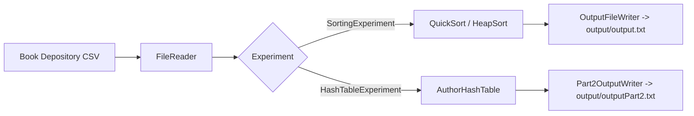

# Architecture

This document catalogs the data structures, algorithms, experiment programs and the
build/test layout of the repository. It complements the empirical write-up in
`docs/latex/relatorio.tex`.

## Overview

The project empirically analyzes fundamental data structures and sorting algorithms over the
[Book Depository dataset](https://www.kaggle.com/datasets/sp1thas/book-depository-dataset).
Each structure/algorithm is instrumented to record runtime and operation counts, and two
experiment entry points drive the measurements and persist their results under `output/`.

All source is UTF-8 and Java 17. File access is performed through relative or classpath paths
(`java.nio.file.Paths`, `Files`, classpath resources) with explicit `StandardCharsets.UTF_8`,
so the build and the programs behave identically on Linux, macOS and Windows.

```
src/main/java/com/bookdepository/
├── model/            Domain entities (Record, Author)
├── algorithms/
│   └── sorting/      QuickSort, HeapSort (instrumented)
├── structures/
│   ├── bst/          BinarySearchTree
│   ├── hashtable/    AuthorHashTable (open addressing, double hashing)
│   └── linkedlist/   LinkedList (singly linked)
├── experiments/      SortingExperiment, HashTableExperiment (main programs)
└── io/               FileReader, OutputFileWriter, Part2OutputWriter, PerformanceResult
```

## Data structures

| Structure | Source | Key operations | Notes |
| --- | --- | --- | --- |
| Binary search tree | `structures/bst/BinarySearchTree.java` | `insert` (de-dupes equal keys), `contains`, `inOrder`, `height`, `size` | Recursive, generic `<T extends Comparable<T>>`. In-order traversal yields ascending order. |
| Hash table | `structures/hashtable/AuthorHashTable.java` | `insertOrIncrement`, `find`, `getAllAuthors`, `loadFactor`, `getCollisions` | Open addressing with double hashing; resizes at load factor 0.7; specialised for counting `Author` frequencies. |
| Singly linked list | `structures/linkedlist/LinkedList.java` | `append`/`prepend` (O(1)), `indexOf`, `remove`, `get`, `size` | Tracks head and tail for constant-time ends. |

## Sorting algorithms

| Algorithm | Source | Metrics captured |
| --- | --- | --- |
| QuickSort | `algorithms/sorting/QuickSort.java` | comparisons, swaps, execution time (ms) |
| HeapSort | `algorithms/sorting/HeapSort.java` | comparisons, swaps, execution time (ms) |

Both sort `Record[]` by `bestsellersRank` and return a `PerformanceResult`
(`io/PerformanceResult.java`) carrying the input size and the captured metrics.

## Domain model

| Type | Source | Role |
| --- | --- | --- |
| `Record` | `model/Record.java` | A book record: id, title, bestsellers rank, price, authors, categories, ISBNs, rating. |
| `Author` | `model/Author.java` | An author with id, name and a frequency counter; `compareByFrequency` orders by count. |

## I/O layer

| Type | Source | Responsibility |
| --- | --- | --- |
| `FileReader` | `io/FileReader.java` | Reads sample sizes (`input/input.txt`), records and authors CSVs. Directories overridable via `BD_INPUT_DIR` / `BD_DATA_DIR`. Auto-detects `;`/`,` delimiters; UTF-8. |
| `OutputFileWriter` | `io/OutputFileWriter.java` | Appends sorting results as `size,comparisons,swaps,time_ms` blocks to `output/output.txt` (`BD_OUTPUT_DIR` overridable). |
| `Part2OutputWriter` | `io/Part2OutputWriter.java` | Writes the ranked most-frequent-authors report to `output/outputPart2.txt`. |
| `PerformanceResult` | `io/PerformanceResult.java` | Immutable metrics value object (size, comparisons, swaps, time). |

All readers/writers resolve paths relative to the working directory (or the `BD_*_DIR`
environment overrides) and never hard-code OS-specific separators or absolute paths.

## Experiment programs

| Program | Source | Flow |
| --- | --- | --- |
| Sorting (Part I) | `experiments/SortingExperiment.java` | `FileReader` -> sort each size with QuickSort and HeapSort -> `OutputFileWriter`. |
| Hash table (Part II) | `experiments/HashTableExperiment.java` | `FileReader` -> count author frequencies in `AuthorHashTable` -> rank -> `Part2OutputWriter`. |



## Test layout

Tests live under `src/test/java/com/bookdepository` with one focused class per structure or
program. Naming drives the Maven phase:

- `*Test` -> Surefire, runs in the `test` phase (`./mvnw -B test`).
- `*IntegrationTest` -> Failsafe, runs in the `verify` phase (`./mvnw -B verify`).
- `*Benchmark` -> excluded from the normal test run (JMH).

| Test class | Target | Phase |
| --- | --- | --- |
| `structures/bst/BinarySearchTreeTest` | BinarySearchTree | test |
| `structures/hashtable/AuthorHashTableTest` | AuthorHashTable | test |
| `structures/linkedlist/LinkedListTest` | LinkedList | test |
| `algorithms/sorting/QuickSortTest` | QuickSort | test |
| `algorithms/sorting/HeapSortTest` | HeapSort | test |
| `performance/PerformanceTest` | sorting timing | test |
| `experiments/SortingExperimentIntegrationTest` | sorting pipeline (e2e) | verify |
| `experiments/HashTableExperimentIntegrationTest` | author-frequency pipeline (e2e) | verify |
| `benchmark/SortingBenchmark` | JMH microbenchmark | excluded |

Test fixtures (`sample-records.csv`, `sample-authors.csv`, etc.) live in
`src/test/resources` and are loaded from the classpath via `test/ResourceLoader.java`.

## Build and tooling

- **Maven** project (`pom.xml`), Java 17 source/target, UTF-8 source encoding, JUnit 5.
- **Maven Wrapper** (`mvnw`, `mvnw.cmd`, `.mvn/wrapper/maven-wrapper.properties`) pins the
  Maven version and downloads it on first use, so no global Maven install is required and the
  build is identical across operating systems.
- **Surefire** runs unit tests; **Failsafe** runs `*IntegrationTest` end-to-end tests.
- **JaCoCo** produces coverage; **Spotless** and **Checkstyle** enforce formatting/style in the
  `verify` phase.
- **CI** (`.github/workflows/ci.yml`) runs `./mvnw -B test` on a matrix of
  `ubuntu-latest`, `macos-latest`, `windows-latest` x JDK 17 and 21, an `e2e` job running
  `./mvnw -B verify` (unit + end-to-end + coverage) on Ubuntu/JDK 21, and an informational
  `lint` job (Spotless + Checkstyle).
