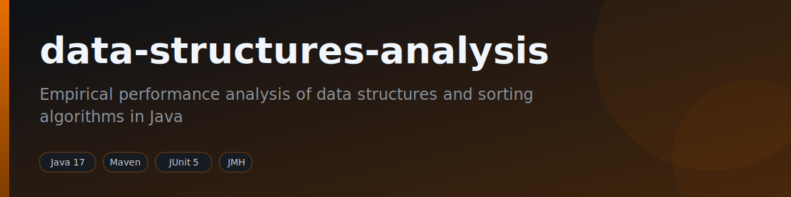
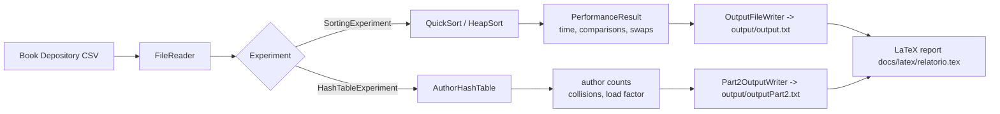

<div align="center">



[](https://github.com/fabricioguidine/data-structures-analysis/actions/workflows/ci.yml)
[](https://github.com/fabricioguidine/data-structures-analysis/actions/workflows/latex.yml)
[](https://codecov.io/gh/fabricioguidine/data-structures-analysis)
[](https://openjdk.org)
[](https://maven.apache.org)
[](LICENSE)

</div>

> Empirical performance analysis of fundamental data structures and sorting algorithms in Java.

This repository implements and benchmarks classic data structures and sorting algorithms over the
[Book Depository dataset](https://www.kaggle.com/datasets/sp1thas/book-depository-dataset) from Kaggle.
Each structure and algorithm is instrumented to record runtime, comparisons, swaps, and collisions across
increasing input sizes, and the results feed a LaTeX report (`docs/latex/relatorio.tex`).

## Table of Contents

- [Data structures](#data-structures)
- [Methodology](#methodology)
- [Requirements](#requirements)
- [Build and run](#build-and-run)
- [Results](#results)
- [Project structure](#project-structure)
- [License](#license)

## Data structures

All implementations live under `src/main/java/com/bookdepository`.

| Structure / Algorithm | File | Operations / metrics measured |
| --- | --- | --- |
| Binary search tree | `structures/bst/BinarySearchTree.java` | `insert`, `contains`, `inOrder`, `height`, `size` |
| Hash table (separate chaining) | `structures/hashtable/AuthorHashTable.java` | `insertOrIncrement`, `find`, load factor, collision count |
| Singly linked list | `structures/linkedlist/LinkedList.java` | `append`, `prepend`, `indexOf`, `remove`, `get` |
| QuickSort | `algorithms/sorting/QuickSort.java` | runtime, comparison count, swap count |
| HeapSort | `algorithms/sorting/HeapSort.java` | runtime, comparison count, swap count |

Two experiment entry points drive the measurements:

| Experiment | File | Purpose |
| --- | --- | --- |
| Sorting | `experiments/SortingExperiment.java` | Times QuickSort vs. HeapSort over each configured input size |
| Hash table | `experiments/HashTableExperiment.java` | Counts and ranks the most frequent authors via the hash table |

## Methodology

Sample sizes are read from `input/input.txt`, records are loaded once from the dataset CSV, and each
algorithm is run per size while a `PerformanceResult` captures timing and operation counts. Results are
written as text blocks to `output/`, then summarized in the LaTeX report.



## Requirements

- JDK 17 or newer (CI builds on Temurin 17 and 21).
- Apache Maven 3.6+.
- Python 3 with the [Kaggle](https://www.kaggle.com/docs/api) CLI (only to download the dataset).

## Build and run

Download the dataset (requires Kaggle API credentials):

```powershell
pip install -r scripts/requirements.txt
python scripts/download_dataset.py
```

This places `dataset_simp_sem_descricao.csv` and `authors.csv` under `data/`.

Build, run the full test suite (unit + integration) with coverage, and apply Spotless/Checkstyle:

```powershell
mvn verify
```

Build a runnable fat JAR:

```powershell
mvn -DskipTests package
```

Run the experiments (the sorting experiment is the JAR's main class):

```powershell
# Sorting experiment (QuickSort vs. HeapSort)
java -jar target/bookdepository-ds-analysis-jar-with-dependencies.jar

# Hash table experiment (most frequent authors)
java -cp target/bookdepository-ds-analysis-jar-with-dependencies.jar com.bookdepository.experiments.HashTableExperiment
```

Compile the LaTeX report locally (or let the `LaTeX` workflow build it on push):

```powershell
latexmk -pdf -cd docs/latex/relatorio.tex
```

## Results

Experiments write plain-text result blocks consumed by the report:

- `output/output.txt` — per-size timing, comparison, and swap counts for QuickSort and HeapSort.
- `output/outputPart2.txt` — ranked most-frequent authors with hash table collision and load-factor stats.

The full written analysis, including the complexity charts, is in the compiled report produced from
`docs/latex/relatorio.tex` (uploaded as the `relatorio-pdf` artifact by the `LaTeX` workflow).

## Project structure

```
data-structures-analysis/
├── src/
│   ├── main/java/com/bookdepository/
│   │   ├── algorithms/sorting/   # QuickSort, HeapSort
│   │   ├── structures/           # bst, hashtable, linkedlist
│   │   ├── experiments/          # SortingExperiment, HashTableExperiment
│   │   ├── io/                   # FileReader, output writers, PerformanceResult
│   │   └── model/                # Author, Record
│   └── test/java/...             # JUnit 5 unit, integration, and JMH benchmark tests
├── scripts/                      # Kaggle dataset downloader
├── docs/latex/                   # LaTeX report sources
├── checkstyle.xml
├── pom.xml
└── README.md
```

## License

Released under the [MIT License](LICENSE).
